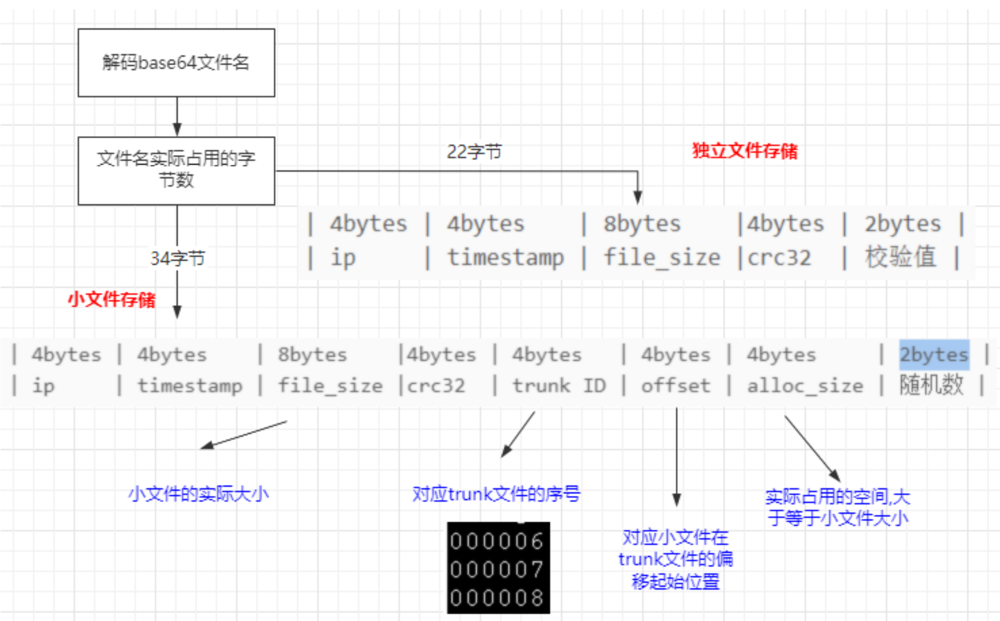
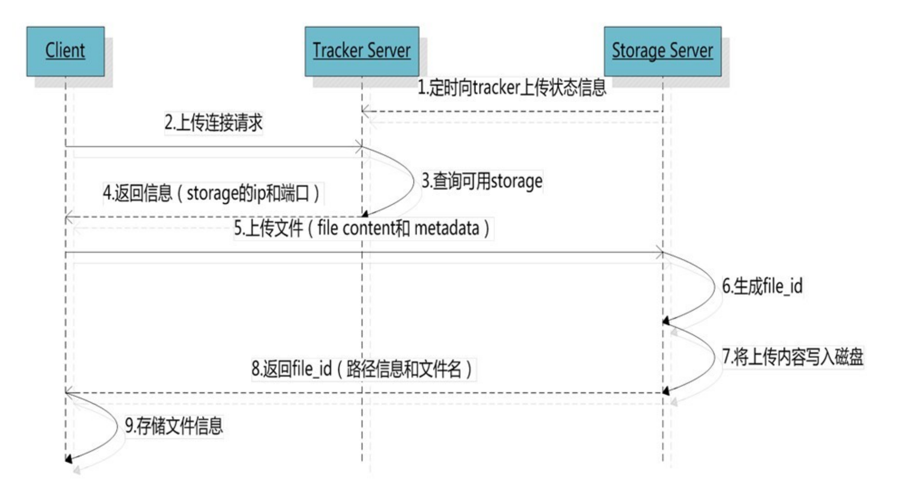
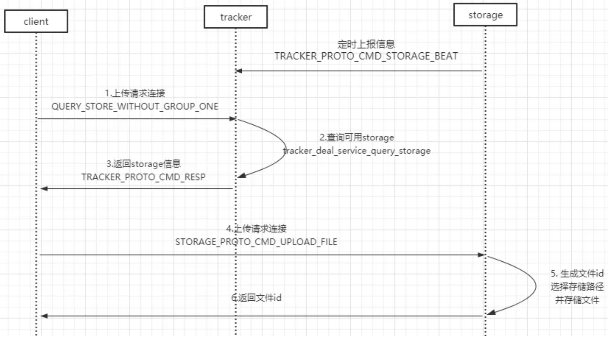
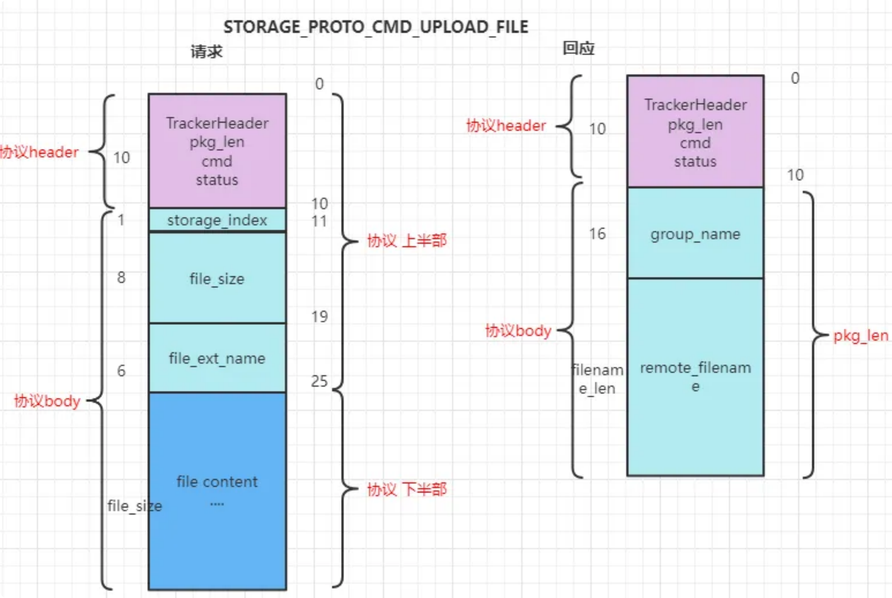
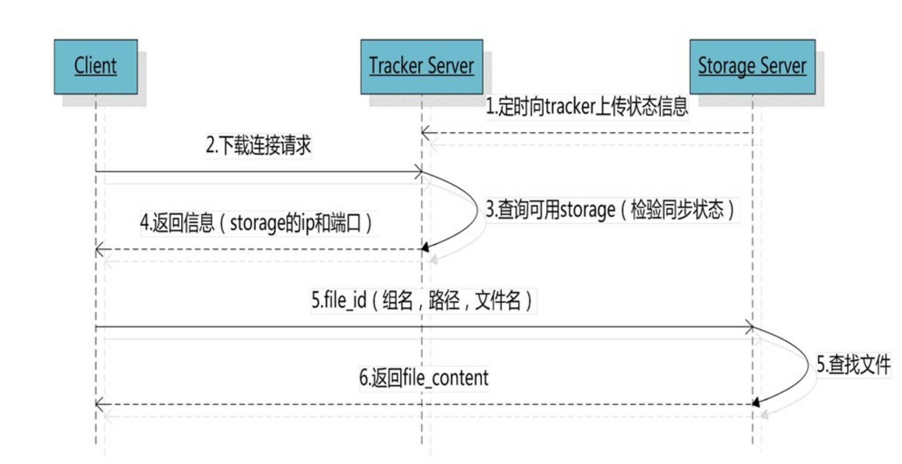
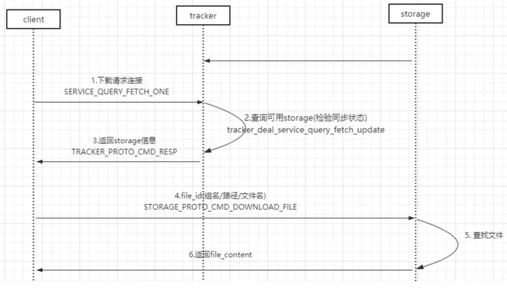
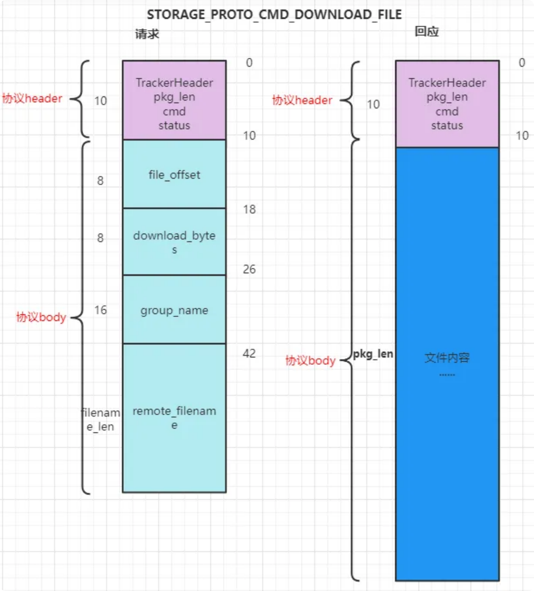

# 1. 海量小文件存储和file_id
## 1.1 为什么需要小文件存储
### 1.1.1 小文件应用场景
通常，我们认为大小在**1MB以内的文件称为小文件**，百万数量级已经为海量，由此量化定义海量小文件问题。如社交网络、电子商务、广电、网络视频、高性能计算，比如：
+ 著名社交网站Facebook存储了600亿张以上的图片，推出了专门针对海量小图片定制优化的Haystack进行存储。
+ 淘宝目前应该是以最大的C2C电子商务网站，存储超过200亿张图片，平均大小均为15KB，也推出了针对小文件优化的TFS文件系统存储这些图片，并且进行了开源。
+ 动漫渲染和影视后期制作应用，会使用大量的视频、音频、图像、纹理等原理素材，一部普通的动画电影可能包含超过500万的小文件，平均大小在10-20KB之间。
+ 金融票据影响，需要对大量原始票据进行扫描形成图片和描述信息文件，单个文件大小为几KB至几百KB不等，文件数量达到数千万乃至数亿，并且逐年增长。
应用范例：vivo FastDFS 海量小文件存储解决之道https://mp.weixin.qq.com/s/Tk_H-ofrS5_kLwT1DZsxyA

### 1.1.2 小文件存储带来的问题
Linux通过node存储文件信息，但inode也会消耗硬盘空间，所以硬盘格式化的时候，操作系统自动将硬盘分成两个区域。
1. 一个是数据区，存放文件数据；
2. 另一个是inode区（inode table），存放inode所包含的信息。
每个inode节点的大小，一般是128字节或256字节（ext4），inode字节的总数在格式化的时候就已经确定，一般是每1KB或者2KB就设置一个inode。假定在一块1GB的硬盘中，每个inode节点的大小为128字节，每1KB就设置一个inode，那么inode table的大小就会达到128MB，占整块硬盘的12.8%。
因此，小文件主要有2个问题：
1. 如果小文件都<1KB，**而系统初始化的时候每个2K设置一个node，则此时一个文件还是至少占用2KB的空间**，最后导致磁盘空间利用率不高，<50%。
2. 大量的小文件，导致在增加、查找、删除文件的时候需要**遍历过多的node节点，影响效率**。

## 1.2 小文件机制配置
合并文件存储相关的配置都在`tracker.conf`中。FastDFS想要支持小文件存储机制，只需要设置`tracker`的`use_trunk_file=true, store_server=1`，其他保持默认。
> #是否启用trunk存储，缺省为false
use_trunk_file = true
#trunk文件最小分配单元字节，缺省为256，即使上传的文件只有10字节，也会如此分配。
slot_min_size = 256
#trunk内部存储的最大文件，超过该值会被独立存储，缺省为16M，超过这个size的文件不会存储到trunk file中，而是作为一个单独的文件直接存储到文件系统重，这里设置为1M只是为了更方便测试。
slot_max_size = 1MB
#trunk文件大小，默认为64MB，不要设置得过大或者过小，最好不要超过256MB
trunk_file_size = 64MB

## 1.3 合并存储文件命名与文件
向FastDFS上传文件成功时，服务器返回该文件的存取ID叫做fieid；
+ 当没有启动合并存储时该fileid和磁盘上实际存储的文件一一对应
+ 当采用合并存储时就不再一一对应，而是多个fileid存储乘一个大文件
*注：我们默认将合并存储后的大文件统称为**Trunk文件**，没有合并存储的文件称为**源文件**。*
(1) Trunk文件：storage服务器磁盘上存储的实际文件，默认大小为64KB。
(2) 合并存储文件的Fileid：表示服务器启动合并存储之后，每次上传返回给客户端的Fileid，此时该Fileid与磁盘上的文件没有一一对应关系。
(3) 没有合并存储的Fileid：表示服务器未启用合并存储时，Upload时返回的Fileid。

### 1.3.1 启动小文件存储时返回给客户端的fileid有变化

1. **独立文件存储的file id**
文件名（不含后缀名）采用Base64编码，包含如下5个字段（每个字段均为4字节整数）：
`group1/M00/00/00/wKgqHV4OQQyAbo9YAAAA_fdSpmg855.txt`
这个文件名中，处理`.txt`为文件后缀，`wKgqHV4OQQyAbo9YAAAA_fdSpmg855`这部分是一个base64编码缓冲区，组成如下：
+ `storage_id`（ip的数值型）源storage serve ID或IP地址
+ `timestamp` 文件创建时间戳
+ `file_size` 若原始值为32位则前面加入一个随机值填充，最终为64位
+ `crc32` 文件内容的校验码
+ 随机数，防止生成重名文件
```
wKgqHV4OQQyAbo9YAAAA_fdSpmg855
| 4bytes | 4bytes | 8bytes |4bytes | 2bytes |
| ip | timestamp | file_size |crc32 | 随机数 |
```
2. **小文件存储的file id**
如果采用了合并存吹，生成的文件ID将会增长，文件后面多了base64文本长度16字符（12个字节）。这部分同样采用了base64编码，包含如下几个字段：
`group1/M00/00/00/eBuDxWCwrDqITi98AAAA-3Qtcs8AAAAAQAAAgAAAAIA833.txt`
采用合并的文件ID更长，因为其中需要加入保存的大文件id以及偏移量，具体包括了如下信息：
+ storage_id (ip的数值型) 源storage server ID或IP地址
+ timestamp 文件创建时间戳
+ file_size 文件的实际大小
+ crc32 文件内容的crc32码
+ trunk file ID trunk文件ID如000001
+ offset 文件内容在**trunk文件中的偏移量**
+ alloc_size 分配空间，大于或者等于文件大小
+ 随机数 防止生成重名文件
```
eBuDxWCwrDqITi98AAAA-3Qtcs8AAAAAQAAAgAAAAIA833
| 4bytes | 4bytes | 8bytes |4bytes | 4bytes | 4bytes | 4bytes | 2bytes |
| ip | timestamp | file_size |crc32 | trunk ID | offset | alloc_size | 随机数 |
```
### 1.3.2 Trunk文件存储结构
#### 1.3.2.1 磁盘数据内部结构
`trunk`内部是由多个小文件组成，每个小文件都会有一个trunkHeader，以及紧跟在其后的真实数据，结构如下：
```
|||——————————————————————— 24bytes ——————————————————————————————————————|||
|—1byte —|— 4bytes —|— 4bytes —|—4bytes— |—4bytes—|———— 7bytes ————|
|—filetype—|—alloc_size—|—filesize—|—crc32 —|—mtime —|—formatted_ext_name—|
|||—————————————————————— file_data filesize bytes ——————————————————————|||
|———————————————————————— file_data ———————————————————————————————————————|
```
Trunk文件默认为64MB，因此每次创建一个Trunk文件总是会产生空余空间，比如为存储一个10MB文件，创建一个Trunk文件，那么就会剩下接近54MB的空间（TrunkHeader有24字节， 暂时忽略）。下次想要再次存储10MB的文件时就不需要创建新的文件，存储在已经创建的Trunk文件中即可，另外当删除一个存储的文件时，也会产生空余空间。
**每次创建一个Trunk文件，是按照既定的文件大小去创建该文件`trunk_file_size`，当要删除Trunk文件时，需要该Trunk文件没有存储小文件时才能删除。**

#### 1.3.2.2 小文件存储平衡树
**在storage内部会为每个storage_path构造一颗以空闲块大小为关键字的空闲平衡树**，相同大小的空闲块保存在链表之中，每当需要存储一个文件时会首先到平衡树中查找大于并且最接近的空闲块，然后试着从该空闲块中分割出多余的部分作为一个新的空闲块，加入到空闲平衡树中，例如：
+ 要求存储文件为300KB，通过空闲平衡树找到一个350KB的空闲块，那么就会将350KB的空闲块分裂为两块，前面300KB返回用于存储，后面50KB则继续放置在空闲平衡树中。
+ 假如此时找不到可满足的空闲块，就会创建一个新的64MB的Trunk文件，将其加入到空闲平衡树之中，再次执行上面的查找操作。
+ 详细代码见 `stroage\trunk_mgr\trunk_mem.c`搜索avl_tree_insert、avl_tree_find等函数


# 2. FastDFS交互协议格式
FastDFS采用二进制TCP通信协议。一个数据包由包头（header）和包体（bodey）组成。包头只有10个字节，格式如下
@ pkg_len：8字节整数，body长度，不包含header，只是body的长度
@ cmd：1字节整数，命令码
@ status：1字节整数，状态码，0表示成功，非0失败（UNIX错误码）
```
tracker\tracker_proto.h TrackerHeader
#define FDFS_PROTO_PKG_LEN_SIZE 8 //8字节
typede fstruct
{
    char pkg_len[FDFS_PROTO_PKG_LEN_SIZE]; // body长度，不包括header
    FDFS_PROTO_PKG_LEN_SIZE 8
    char cmd; //command 命令
    char status; //status code for response 响应的状态码
} TrackerHeader;
即是头部固定10字节，body长度通过pkg_len给出。
即是一帧完整的协议为 TrackerHeader + body数据（可以为0）。
```

# 3. 文件上传原理和负载均衡方法


```
STORAGE_PROTO_CMD_UPLOAD_FILE：上传普通文件
# 请求body：
@store_path_index：1字节整数，基于0的存储路径顺序号
@meta_data_length：8字节整数，meta data（文件附加属性）长度，可以为0
@file_size：8字节整数，文件大小
@file_ext_name：6字节字符串，不包括小数点的文件扩展名，例如 jpeg、tar.gz
@meta_data： meta_data_length字节字符串，文件附加属性，每个属性用字符 \x01分隔，名称key和取值
value之间用字符 \x02分隔
@file content：file_size字节二进制内容，文件内容 # 响应body：
@group_name：16字节字符串，组名
@ filename：不定长字符串，文件名
```


## 3.1 选择tracker server
当集群中不止一个tracker server时，由于tracker之间是完全对等的关系，客户端在upload文件时可以任意选择一个tracker。
（高可用，通过冗余的方式提供服务）

## 3.2 选择存储的group
当tracker收到upload file的请求时，会为改文件分配一个可以存储该文件的group，支持如下选择group规则：
1. `Round robin` 所有的group间轮循
2. `Specified group` 指定某一个确定的group
3. `Load balance` 选择最大剩余空间的组上传文件

## 3.3 选择storage server
当选定group之后，tracker会在group内选择一个storage server给客户段，支持如下选择storage的规则：
1. `Round robin` 在group内的所有storage间轮循
2. `First server ordered by ip` 按ip排序
3. `First server ordered by priority` 按优先级排序（优先级在storage上配置）

## 3.4 选择storage path
当分配好storage server后，客户端向storage发送写文件请求，storage将会为文件分配一个数据存储目录，支持规则如下：
1. `Round robin` 多个存储目录间轮循
2. 剩余存储空间最多的优先
```
FastDFS 集群
  └── Tracker Server (协调者)
      └── Group 1 (存储组)
          ├── Storage Server 1 (存储服务器)
          │   ├── Storage Path 1 (存储路径)
          │   └── Storage Path 2
          ├── Storage Server 2
          │   ├── Storage Path 1
          │   └── Storage Path 2
          └── ... (更多 Storage Server)
      └── Group 2
          ├── Storage Server 1
          ├── Storage Server 2
          └── ...
      └── ... (更多 Group)
```

**总结关系：**
+ **Group 是容器:** Group 是一个 容器，包含多个 Storage Server。
+ **Storage Server 是副本:** 同一个 Group 内的 Storage Server 互为 副本，存储相同的数据。
+ **Group 是分片单元:** 不同的 Group 存储 不同的文件，实现数据分片和负载均衡。
+ **Group 内冗余，Group 间分片。** 这是 FastDFS 数据存储的核心设计思想。
+ **store_server_count 控制副本数量，也影响 Group 的冗余能力。** 更高的 store_server_count 提供更高的冗余性，但也需要更多的存储资源。

## 3.5 生成fileid
当选定存储目录之后，storage会为文件生成一个fileid，由：
+ storage server ip
+ 文件创建时间
+ 文件大小
+ 文件crc32
+ 一个随机数
拼接而成，然后将这个二进制字符串进行base64编码，转换为可以打印的字符串。

### 3.5.1 选择两级目录
当选定存储目录之后，storage会为文件分配一个fileid，每个存储下有两集256*256的子目录，storage会按文件fileid进行两次hash（似乎是这样，需要看源码），路由到其中一个子目录，然后将文件以fileid为文件名存储到该子目录下。
一个目录存储一百万文件，然后单个子目录平局为一百万 / (256 * 256) = 15.2个文件

### 3.5.2 生成文件名
当文件存储到某个子目录之后，即认为该文件存储成功， 接下来会为改文件生成一个文件名，文件名有：group、存储目录、两级子目录、fileid、文件后缀名（由客户端指定，主要用于区分文件类型）拼接而成。

文件名规则：
+ `storage_id`ip的数值型源storage server ID或IP地址
+ `timestamp` 文件创建时间戳
+ `file_size` 若原始值为32位则前面加入一个随机值填充，最终为64位
+ `crc32` 文件内容的检验码
+ 随机数 引入随机数的目的是防止生成重名文件


# 4. 下载文件逻辑
客户端`upload file`成功后，会拿到一个storage生成的文件名，接下来客户端根据这个文件名即可访问到该文件。
通过fastdfs客户端下载，比如
```bash
fdfs_download_file /etc/fdfs/client.conf
group1/M00/00/00/ctepQmIWJTCAcldiAAAHuj79dAY04.conf
```


```
STORAGE_PROTO_CMD_DOWNLOAD_FILE：下载文件
# 请求body：
@file_offset：8字节整数，文件偏移量
@download_bytes：8字节整数，下载字节数
@group name：16字节字符串，组名 @filename：不定长字符串，文件名
# 响应body：@file_content：不定长二进制内容，文件内容
```

跟upload file一样，在download file时客户端可以任意选择tracker server。

tracker发送download请求给某个tracker，必须带上文件名信息，tracker从文件名中解析出文件的**group、大小、创建时间**等信息，然后为该请求选择一个storage用来服务读请求。

由于group内的文件同步时在后台一步进行，所以有可能出现在读到的时候，文件还没有同步到某些storage server上，为了尽量避免访问到这样的storage，tracker按照如下规则选择group内可读的storage。
    1. 该文件上传到源头storage，源头的storage只要存活，肯定包含这个文件，源头的地址IP被编码在文件名字中。
    2. 文件创建时间戳 == storage被同步到的时间戳且（当前时间 - 文件创建时间戳）> 文件同步最大时间。文件创建后，认为经过最大同步时间之后，肯定已经同步到其他storage了。
    3. 文件创建时间戳 < storage被同步的时间戳 或者（当前时间 - 文件创建时间戳）> 同步延迟阈值，都可以保证同步。