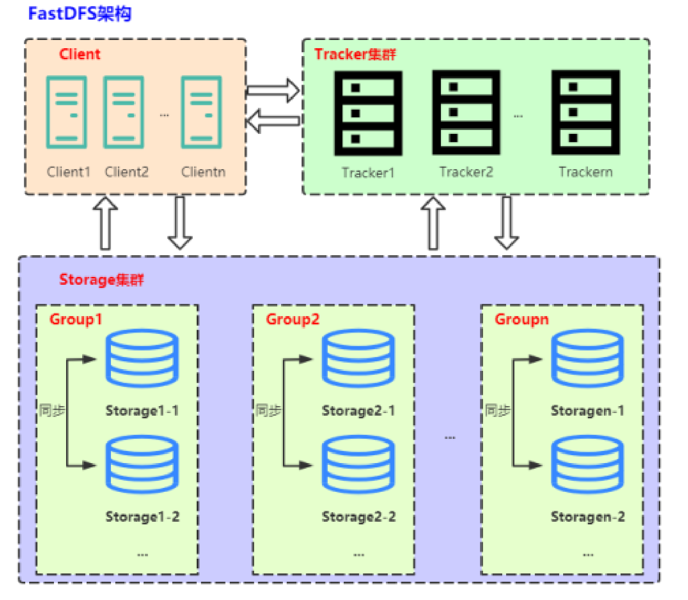

# 1. 集群部署 ———— 2个tracker server, 2个storage server

注：多个tracker可以在同一台机器上，多个storage不能在同一台机器上。*IP皆为内网IP。*

| 服务器地址    | 服务程序        | 对应配置文件(端口区分)                     |
| ------------- | --------------- | ---------------------------------------- |
| 10.168.2.101  | fdfs_trackerd   | tracker_1.conf, 之前tracker.conf 路径 tracker_1 |
| 10.168.2.100  | fdfs_trackerd   | tracker_1.conf                          |
| 10.168.2.101  | **fdfs_storaged** | storage_1.conf                          |
| 10.168.2.100  | **fdfs_storaged** | storage_1.conf                          |


# 2. tracker 和 storage目录结构
## 2.1 tracker server目录及文件结构
```
/home/fastdfs/tracker_1# tracker server目录及文件结构
├── data
│ ├── fdfs_trackerd.pid
│ ├── storage_changelog.dat storage有修改过ip
│ ├── storage_groups_new.dat 存储分组信息
│ ├── storage_servers_new.dat 存储服务器列表 重要
│ └── storage_sync_timestamp.dat 同步时间戳
└── logs
└── trackerd.log Server日志文件
```
*数据文件storage_groups.dat和storage_servers.dat中的记录之间以换行符（n）分隔，字段之间以西文逗号（,）分隔。*

**storage_groups_new.dat**参数如下：
#group_name: 组名
#storage_port: storage server端口号
```
# global section
[Global]
    group_count=1
# group: group1
[Group001]
    group_name=group1
    storage_port=23000
    storage_http_port=8888
    store_path_count=1
    subdir_count_per_path=256
    current_trunk_file_id=0
    trunk_server=
    last_trunk_server=
```
**storage_servers_new.dat**参数如下：
+ group_name：所属组名
+ ip_addr：ip地址
+ status：状态
+ sync_src_ip_addr：向该storage server同步已有数据文件的源服务器
+ **sync_until_timestamp：**同步已有数据文件的截至时间（UNIX时间戳）
+ stat.total_upload_count：上传文件次数
+ stat.success_upload_count：成功上传文件次数
+ stat.total_set_meta_count：更改meta data次数
+ stat.success_set_meta_count：成功更改meta data次数
+ stat.total_delete_count：删除文件次数
+ stat.success_delete_count：成功删除文件次数
+ stat.total_download_count：下载文件次数
+ stat.success_download_count：成功下载文件次数
+ stat.total_get_meta_count：获取meta data次数
+ stat.success_get_meta_count：成功获取meta data次数
+ **stat.last_source_update：**最近一次源头更新时间（更新操作来自客户端）
+ **stat.last_sync_update：**最近一次同步更新时间（更新操作来自其他storage server的同步）
```
# storage 10.168.2.101:23000
[Storage001]
    group_name=group1
    ip_addr=192.168.1.18
    status=1
    version=6.07
    join_time=1722429095
    storage_port=23000
    storage_http_port=8888
    domain_name=
    sync_src_server=192.168.1.22
....
# storage 10.168.2.101:23000
[Storage002]
    group_name=group1
    ip_addr=192.168.1.22
    status=7
    version=6.07
    join_time=1722427336
    storage_port=23000
    storage_http_port=8888
    domain_name=
    sync_src_server=192.168.1.18
```

## 2.2 storage server目录及文件结构
```
|__data
| |__.data_init_flag：当前storage server初始化信息
| |__storage_stat.dat：当前storage server统计信息
| |__sync：存放数据同步相关文件
| | |__binlog.index：当前的binlog（更新操作日志）文件索引号
| | |__binlog.###：存放更新操作记录（日志）
| | |__${ip_addr}_${port}.mark：存放向目标服务器同步的完成情况，比如10.168.2.101_23000.mark
| |__一级目录：256个存放数据文件的目录，目录名为十六进制字符，如：00, 1F
| |__二级目录：256个存放数据文件的目录，目录名为十六进制字符，如：0A, CF
|__logs
|__storaged.log：storage server日志文件
```

**.data_init_flag文件格式为ini配置文件方式**
各个参数如下
+ storage_join_time：本storage server创建时间
+ sync_old_done：本storage server是否已完成同步的标志（源服务器向本服务器同步已有数据）
+ sync_src_server：向本服务器同步已有数据的源服务器IP地址，没有则为空
+ sync_until_timestamp：同步已有数据文件截至时间（UNIX时间戳）

**storage_stat.dat文件格式为ini配置文件方式**
各个参数如下：
+ total_upload_count：上传文件次数
+ success_upload_count：成功上传文件次数
+ total_set_meta_count：更改meta data次数
+ success_set_meta_count：成功更改meta data次数
+ total_delete_count：删除文件次数
+ success_delete_count：成功删除文件次数
+ total_download_count：下载文件次数
+ success_download_count：成功下载文件次数
+ total_get_meta_count：获取meta data次数
+ success_get_meta_count：成功获取meta data次数
+ last_source_update：最近一次源头更新时间（更新操作来自客户端）
+ last_sync_update：最近一次同步更新时间（更新操作来自其他storage server）

**sync 目录及文件结构**
+ **binlog.index**中只有一个数据项：当前binlog的文件索引号 binlog.###，
+ **binlog.###**为索引号对应的3位十进制字符，不足三位，前面补0。索引号基于0，最大为999。一个binlog文件最大为1GB。记录之间以换行符（n）分隔，字段之间以西文空格分隔。字段依次为：
    1. timestamp：更新发生时间（Unix时间戳）
    2. op_type：操作类型，一个字符
    3. filename：操作（更新）的文件名，包括相对路径，如：5A/3D/FE_93_SJZ7pAAAO_BXYD.S
+ ${ip_addr}_${port}.mark：ip_addr为同步的目标服务器IP地址，port为本组storage server端口。例如：10.0.0.1_23000.mark。各个参数如下：
    - binlog_index：已处理（同步）到的binlog索引号
    - binlog_offset：已处理（同步）到的binlog文件偏移量（字节数）
    - need_sync_old：同步已有数据文件标记，0表示没有数据文件需要同步
    - sync_old_done：同步已有数据文件是否完成标记，0表示未完成，1表示已完成 （推送方标记）
    - **until_timestamp：同步已有数据截至时间点**（UNIX时间戳） （推送方） 上次同步时间结点
    - scan_row_count：总记录数
    - sync_row_count：已同步记录数
