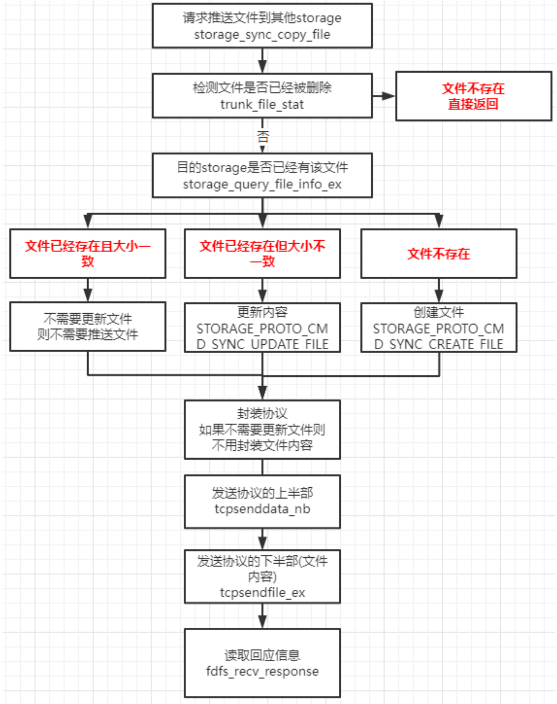

# 1. 集群部署 ———— 2个tracker server, 2个storage server

注：多个tracker可以在同一台机器上，多个storage不能在同一台机器上。*IP皆为内网IP。*

| 服务器地址    | 服务程序        | 对应配置文件(端口区分)                     |
| ------------- | --------------- | ---------------------------------------- |
| 10.168.2.101  | fdfs_trackerd   | tracker_1.conf, 之前tracker.conf 路径 tracker_1 |
| 10.168.2.100  | fdfs_trackerd   | tracker_1.conf                          |
| 10.168.2.101  | **fdfs_storaged** | storage_1.conf                          |
| 10.168.2.100  | **fdfs_storaged** | storage_1.conf                          |


# 2. tracker 和 storage目录结构
## 2.1 tracker server目录及文件结构
```
/home/fastdfs/tracker_1# tracker server目录及文件结构
├── data
│ ├── fdfs_trackerd.pid
│ ├── storage_changelog.dat storage有修改过ip
│ ├── storage_groups_new.dat 存储分组信息
│ ├── storage_servers_new.dat 存储服务器列表 重要
│ └── storage_sync_timestamp.dat 同步时间戳
└── logs
└── trackerd.log Server日志文件
```
*数据文件storage_groups.dat和storage_servers.dat中的记录之间以换行符（n）分隔，字段之间以西文逗号（,）分隔。*

**storage_groups_new.dat**参数如下：
#group_name: 组名
#storage_port: storage server端口号
```
# global section
[Global]
    group_count=1
# group: group1
[Group001]
    group_name=group1
    storage_port=23000
    storage_http_port=8888
    store_path_count=1
    subdir_count_per_path=256
    current_trunk_file_id=0
    trunk_server=
    last_trunk_server=
```
**storage_servers_new.dat**参数如下：
+ group_name：所属组名
+ ip_addr：ip地址
+ status：状态
+ sync_src_ip_addr：向该storage server同步已有数据文件的源服务器
+ **sync_until_timestamp：**同步已有数据文件的截至时间（UNIX时间戳）
+ stat.total_upload_count：上传文件次数
+ stat.success_upload_count：成功上传文件次数
+ stat.total_set_meta_count：更改meta data次数
+ stat.success_set_meta_count：成功更改meta data次数
+ stat.total_delete_count：删除文件次数
+ stat.success_delete_count：成功删除文件次数
+ stat.total_download_count：下载文件次数
+ stat.success_download_count：成功下载文件次数
+ stat.total_get_meta_count：获取meta data次数
+ stat.success_get_meta_count：成功获取meta data次数
+ **stat.last_source_update：**最近一次源头更新时间（更新操作来自客户端）
+ **stat.last_sync_update：**最近一次同步更新时间（更新操作来自其他storage server的同步）
```
# storage 10.168.2.101:23000
[Storage001]
    group_name=group1
    ip_addr=192.168.1.18
    status=1
    version=6.07
    join_time=1722429095
    storage_port=23000
    storage_http_port=8888
    domain_name=
    sync_src_server=192.168.1.22
....
# storage 10.168.2.101:23000
[Storage002]
    group_name=group1
    ip_addr=192.168.1.22
    status=7
    version=6.07
    join_time=1722427336
    storage_port=23000
    storage_http_port=8888
    domain_name=
    sync_src_server=192.168.1.18
```

## 2.2 storage server目录及文件结构
```
|__data
| |__.data_init_flag：当前storage server初始化信息
| |__storage_stat.dat：当前storage server统计信息
| |__sync：存放数据同步相关文件
| | |__binlog.index：当前的binlog（更新操作日志）文件索引号
| | |__binlog.###：存放更新操作记录（日志）
| | |__${ip_addr}_${port}.mark：存放向目标服务器同步的完成情况，比如10.168.2.101_23000.mark
| |__一级目录：256个存放数据文件的目录，目录名为十六进制字符，如：00, 1F
| |__二级目录：256个存放数据文件的目录，目录名为十六进制字符，如：0A, CF
|__logs
|__storaged.log：storage server日志文件
```

**.data_init_flag文件格式为ini配置文件方式**
各个参数如下
+ storage_join_time：本storage server创建时间
+ sync_old_done：本storage server是否已完成同步的标志（源服务器向本服务器同步已有数据）
+ sync_src_server：向本服务器同步已有数据的源服务器IP地址，没有则为空
+ sync_until_timestamp：同步已有数据文件截至时间（UNIX时间戳）

**storage_stat.dat文件格式为ini配置文件方式**
各个参数如下：
+ total_upload_count：上传文件次数
+ success_upload_count：成功上传文件次数
+ total_set_meta_count：更改meta data次数
+ success_set_meta_count：成功更改meta data次数
+ total_delete_count：删除文件次数
+ success_delete_count：成功删除文件次数
+ total_download_count：下载文件次数
+ success_download_count：成功下载文件次数
+ total_get_meta_count：获取meta data次数
+ success_get_meta_count：成功获取meta data次数
+ last_source_update：最近一次源头更新时间（更新操作来自客户端）
+ last_sync_update：最近一次同步更新时间（更新操作来自其他storage server）

**sync 目录及文件结构**
+ **binlog.index**中只有一个数据项：当前binlog的文件索引号 binlog.###，
+ **binlog.###**为索引号对应的3位十进制字符，不足三位，前面补0。索引号基于0，最大为999。一个binlog文件最大为1GB。记录之间以换行符（n）分隔，字段之间以西文空格分隔。字段依次为：
    1. timestamp：更新发生时间（Unix时间戳）
    2. op_type：操作类型，一个字符
    3. filename：操作（更新）的文件名，包括相对路径，如：5A/3D/FE_93_SJZ7pAAAO_BXYD.S
+ ${ip_addr}_${port}.mark：ip_addr为同步的目标服务器IP地址，port为本组storage server端口。例如：10.0.0.1_23000.mark。各个参数如下：
    - binlog_index：已处理（同步）到的binlog索引号
    - binlog_offset：已处理（同步）到的binlog文件偏移量（字节数）
    - need_sync_old：同步已有数据文件标记，0表示没有数据文件需要同步
    - sync_old_done：同步已有数据文件是否完成标记，0表示未完成，1表示已完成 （推送方标记）
    - **until_timestamp：同步已有数据截至时间点**（UNIX时间戳） （推送方） 上次同步时间结点
    - scan_row_count：总记录数
    - sync_row_count：已同步记录数


# 3. FastDFS文件同步
storage定时发送心跳包到tracker，并且附带同步的时间节点，tracker返回其他的stroage的状态。

正常文件上传完成之后，就记录到`binlog`缓存冲，系统定时刷入`binlog`文件。
系统有线程定时读取`binlog`文件，当有新增行时，判断该记录是源文件记录还是副本文件记录。
系统只主动发送源文件，副本文件不做处理（非启动时流程）。

注：
1. 系统在`strage_servers.dat`文件中指定`sync_src_server`为源文件的server，其他server均从源server中同步，不必担心双向同步问题。
2. 加入新的storage server的时候会为其指定源server。
3. `binlog`格式为 `timestamp(Unix时间戳) op_type(操作类型) filename(相对路径文件名)` 示例：`1722429095 C 5A/3D/FE_93_SJZ7pAAAO_BXYD.S`。单个`binlog`大小设置为1G，之后会创建新文件，文件名从`binlog.000`到`binlog.999`。
4. 上传文件到A后立即下载，一般不会出现从B下载但B未同步的情况。默认采取读源storage server的策略，其余的server在时间戳大于最大同步时间戳的时候才会选择。

线程：
+ `tracker_report_thread_entrance`，连接tracker有独立的线程，连接n个tracker就有n个线程
+ `storage_sync_thread_entrance`，给同group的storage做同步，同组有n个storage，就有n-1个线程

storage的状态
+ #define FDFS_STORAGE_STATUS_INIT 0 初始化，尚未得到同步已有数据的源服务器
+ #define FDFS_STORAGE_STATUS_WAIT_SYNC 1 等待同步，已得到同步已有数据的源服务器
+ #define FDFS_STORAGE_STATUS_SYNCING 2 同步中
+ #define FDFS_STORAGE_STATUS_IP_CHANGED 3
+ #define FDFS_STORAGE_STATUS_DELETED 4 已删除，该服务器从本组中摘除
+ #define FDFS_STORAGE_STATUS_OFFLINE 5 离线
+ #define FDFS_STORAGE_STATUS_ONLINE 6 在线，尚不能提供服务
+ #define FDFS_STORAGE_STATUS_ACTIVE 7 在线，可以提供服务
+ #define FDFS_STORAGE_STATUS_RECOVERY 9

同步命令
+ #define STORAGE_PROTO_CMD_SYNC_CREATE_FILE 16 //新增文件
+ #define STORAGE_PROTO_CMD_SYNC_DELETE_FILE 17 // 删除文件
+ #define STORAGE_PROTO_CMD_SYNC_UPDATE_FILE 18 // 更新文件
+ #define STORAGE_PROTO_CMD_SYNC_CREATE_LINK 19 // 创建链接

## 3.1 同步日志所在目录
比如在10.168.2.101服务器上看到的`sync log`, 10.168.2.101.mark同步状态文件，记录本机到10.168.2.101的同步状态，文件名由同步源ip_端口组成。
binlog.000文件大小最大为1G，超过后会重新生成文件，并更新binlog_index.dat索引值，binlog_index.data记录了当前写binlog的索引id。
如果有不止2个storage，比如还有10.169.2.100,则该目录还在10.168.2.100_23000.mark。

## 3.2 binlog格式
FastDFS文件同步采用binlog异步复制方式。storage server使用binlog文件记录文件上传、删除等操作，根据binlog进行文件同步。binlog中只记录文件ID和操作，不记录文件内容。比如：
```
1646123002 C M00/00/00/oYYBAF285cOIHiVCAACI-7zX1qUAAAAVgAACC8AAIkT490.txt
1646123047 c M00/00/00/oYYBAF285luIK8jCAAAJeheau6AAAAAVgABI-cAAAmS021.xml
1646123193 A M00/00/00/rBMYd2IaLXqASSVXAAAHuj79dAY65.txt
1646123561 d M00/00/00/oYYBAF285luIK8jCAAAJeheau6AAAAAVgABI-cAAAmS021.xml
```
可以看出，binlog文件有三列，依次为
+ **时间戳**
+ **操作类型**
+ **文件ID（不带group名称）**
    - storage_id ip的数值型
    - timestamp 创建时间
    - file_size 64位
    - crc32
文件操作类型采用单个字母编码，其中源头操作用大写字母表示，被同步的操作为对应的小写字母。文件操作字母含义如下：

| 源                       | 副本                        |
| ------------------------ | -------------------------- |
| C：上传文件（upload）     | c：副本创建                |
| D：删除文件（delete）     | d：副本删除                |
| A：追加文件（append）     | a：副本追加                |
| M：部分文件更新（modify）   | m：副本部分文件更新（modify） |
| U：整个文件更新（set metadata） | u：副本整个文件更新（set metadata） |
| T：截断文件（truncate）             | t：副本截断文件（truncate）             |
| L：创建符号链接（文件去重功能，相同内容只保存一份） | l：副本创建符号链接（文件去重功能，相同内容只保存一份） |

同组内的storage server是对等的。文件上传、删除操作可以在任意一台storage server上进行。文件同步只在同组内的storage server进行，采用push方式，即**源头服务器同步给本组的其他存储服务器**。对于同组的其他storage server，一台storage server分别启动一个线程进行文件同步。
注： **源表示客户端直接操作的那个storage server为源，其他的storage server为副本**

文件同步采用增量的方式，**记录已同步的位置到mark文件中**。mark文件存放路径为`$base_path/data/sync/`。内容示例：
10.168.2.100_23000.mark
```
binlog_index=0 //binlog索引id 表示上次同步给10.168.2.100_23000机器的最后一条binlog文件索引
binlog_offset=3944 //当前时间binlog 大小 (单位是字节)表示上次同步给10.168.2.100_23000机器的最后一条binlog偏移量，若程序重启了，也只要从这个位置开始向后同步即可。
need_sync_old=1 //是否需要同步老数据
sync_old_done=1 //是否同步完成
until_timestamp=1621667115 //同步已有数据文件的截至时间
scan_row_count=68 //扫描记录数
sync_row_count=53 //同步记录数
```

## 3.3 同步规则
1. 只在本组内的storage server之间同步。
2. 源头数据才需要同步，备份数据之间不需要同步，用binlog的操作类型大小写来区分。
3. 当增加一台storage server时，由已有的一台storage server将已有的所有数据（包括源头数据和备份数据）同步给该新增服务器。

## 3.4 binlog同步过程
在FastDFS中，每个storage server之间的同步都是由一个独立的线程负责，该线程中的所有操作都是以同步的方式执行。比如一组服务器由A, B, C三台机器，那么每台机器上有两个线程负责同步，如A机器，线程1负责同步数据到B，线程2负责同步数据到C。

### 3.4.1 获取组内的其他storage信息tracker_report_thread_entrance，并且启动同步线程
`tracker_report_thread_entracne`线程负责向tracker上报信息。
在storage.conf配置文件中，只配置了tracker的IP地址，并没有配置组内其他的storage。**因此同组的其他stroage server必须从tracker中获取**，过程如下：
1. storage server启动时为每一个配置的tracker启动一个线程负责与该tracker通信。
2. 默认间隔为30s，与tracker发送一次心跳包。**在心跳包的回复中，有该组内其他的storage server的信息**。
3. storage server获取到同组的其他storage信息之后，为组内的每个其他storage server开启一个线程负责同步。

### 3.4.2 同步线程执行过程storage_sync_thread_entrance
`storage_sync_thread_entrance`同步线程
每个同步线程负责到一个storage server的同步，以阻塞的方式进行。
1. 打开对应的storage的mark文件，如负责到10.168.2.100的同步打开10.169.2.100_23000.mark文件，从中读取binlog_index, binlog_offset两个字段，如读取到的值为0， 100，那么久打开binlog.000文件，seek到100这个位置。
2. 进入一个while循环，尝试读取一行，若读取不到则睡眠等待，若读取到一行，并且改行的操作方式为源操作，如C, A, D, T(大写)，则将改行指定的操作同步给对方（非源操作不需要同步），同步成功后更新binlog_offsert标志，该值会定期写入到192.168.1.22_23000.makr文件中。
`storage_open_readable_binlog`

storage_sync.c 发送同步文件 `storage_sync_copy_file`
storage_service.c 接收同步文件 `storage_sync_copy_file`
3. 同步前删除：如果同步比较慢，那么有可能开始同步一个文件之前，该文件已经被客户端删除，此时同步线程将打印一条日志，然后接着处理后面的binlog。


## 3.5 storage的最后最早被同步时间
如果一组内有storage-A, storage-B, storage-C三台机器。对于A这台机器来说，B与C机器都会同步binlog给他，A在接收同步时会记录每台机器同步给他的最后时间（binlog中的第一个字段timestamp，这个时间也会更新到storage_stat.dat的last_sync_update）。比如B最后同步给A的binlog-timestamp为100，C最后同步给A的binlog-timestamp为200，那么A机器的最后最早同步时间就是100。
这个值的意义在于，判断一个文件是否存在与某个storage上。**比如A机器的最后最早被同步时间是100**，那么一个文件的创建时间为99，就可以肯定这个文件在A上肯定有。因为一个文件会被upload到组内三台机器的任意一台上：
1. 若是这个文件直接upload到A上，A肯定有。
2. 若是这个文件直接upload到B上，由于B最后同步给A的最后时间是100，也就是100之前的文件都已经同步完毕了，A肯定有。
3. C也一样。

storage会定期将每台机器同步给他的最后时间告诉给tracker，tracker在客户端要下载一个文件时，需要判断一个Storage是否有该文件，只要解析文件的创建时间，然后与该值作比较，若该值大于创建创建时间，说明该Storage存在这个文件，可以从其下载。

