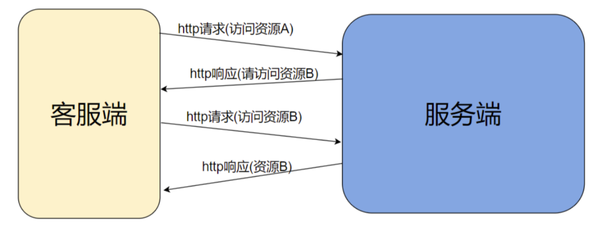

# 1. 短连接
## 1.1 短连接的意义
URL短链，也就是短网址，是将原本较长的网址转换成较短形式的服务。短链的意义主要体现在：
1. **便于分享和传播**：在社交媒体、短信等平台上，短链占用的空间小，可以让用户在有限的字符限制内分享更多的内容。
2. **数据统计**：短链服务通常提供数据统计功能，可以追踪每个短链的点击量 ，帮助网站或者内容创作者了解短链的传播效果。
3. **降低成本**： 在短信营销中，长链接可能会使短信内容超过限制长度，导致需要发送多条短信，使用短链可以减少短信数量，从而节省成本。
4. **匿名访问**： 短链可以隐藏用户的访问来源，通过HTTP的Refer字段无法获取跳转前的来源，为用户提供一定程度的匿名性。
5. **访问控制**： 短链可以设置密码访问，限定访问次数、时段或者黑白名单， 为内容的访问提供更多的控制。
6. **简化二维码**： 长链生成的二维码可能过于复杂，影响识别成功率，短链可以简化二维码的图案，提高扫描识别率。
7. **降低权重传递**： 在搜索引擎优化中，长链接可能会传递权重给其他网站，使用短链可以避免这种情况，保持网站权重不外泄。
8. **适应限制**： 某些平台对链接长度有限制，如早起的微博字数限制，使用短链可以适应这些限制，避免内容被截断。

短链服务通过将长链映射到短链，使得用户在分享和传播链接时更加方便，同时也为网站运营者提供了更多管理和分析工具。

## 1.2 URL重定向
URL重定向，也称为URL转发，是一种当实际资源，如单个页面、表单或者整个Web应用被迁移到新的URL下的时候，保持（原有）URL继续有效的方法。HTTP协议提供了一种特殊形式的响应————HTTP重定向来实现。
简单理解，重定向是指一个Web资源接收到客户端请求后，这个Web资源通知客户端去访问另外一个Web资源，客户端一共会发送两次HTTP请求，大概的流程如下：



# 2. PicHost中的应用
图床项目中短链可以有以下应用：
1. 将图片地址缩短，比如http://10.168.2.101:80/group1/M00/01/48/rBoXTGXmA5uABuhKAADWU76VrkU412.png 缩短为http://10.168.2.101/p/l;
2. 将图片分享地址缩短。可以考虑：http://10.168.2.101/share?urlmd5=owfrxsjybldbefsarcbynecdyggxxpkl 转成短链

## 2.1 服务部署
```proto
syntax = "proto3";
option go_package = "shorturl/proto";
package shorturl_voice;
// 消息定义
message Url {
    string url = 1;
    bool isPublic = 2;
}
message ShortKey {
    string key = 1;
    bool isPublic =2;
}
// 服务定义
service ShortUrl {
    rpc GetShortUrl(Url)returns(ShortKey){} //
    rpc GetOriginalUrl(ShortKey)returns(Url){}
}
```

## 2.2 框架分析
**将原始链接转为短连接**
1. **请求端** 通过 **grpc接口** 发送 **原始链接转短链请求 (GetShortUrl)** 到 `shorturl-server`。
2. `shorturl-server` 首先进行 **OAuth2 鉴权**。
    * **鉴权失败 (N)**: 返回 **鉴权失败**。
    * **鉴权成功 (Y)**: 继续下一步。
3. 服务端 **检查 MySQL 数据库** 中是否已存在该原始链接的数据。
    * **数据已存在 (Y)**:  直接进入下一步 (跳过 ID 生成)。
    * **数据不存在 (N)**: 进入 **GenerateId** 流程，从 MySQL 获取 **自增 ID**。
4. **ToBase62**: 将获取的 **ID 转换为 62 进制字符串**。
5. **Update**: 将 **短链信息更新到 MySQL 数据库**。
6. **cache.Set**: 将短链信息 **添加到或更新到缓存**。
7. **根据域名与 62 进制字符串组织短链接**。
8. 服务端 **返回 短链** 给请求端。
9. 流程中还包含 **GetByOriginal** 模块，用于根据短链接获取原始链接，但具体请求入口未在图中明确标出，图中显示会检查 **数据是否存在 MySQL**。

**将短链还原为原始链接**
1. **请求端** 通过 **grpc接口** 发送 **短链转原始链接请求 (GetOriginalUrl)** 到 `shorturl-server`。
2. `shorturl-server` 首先进行 **OAuth2 鉴权**。
    * **鉴权失败 (N)**: 返回 **鉴权失败**。
    * **鉴权成功 (Y)**: 继续下一步。
3. **ToBase10**: 将短链接 (62进制字符串) **转换为 10 进制 ID**。
4. **cache.Get(key)**: 从 **缓存** 中根据 Key (通常是短链ID) **获取原始链接**。
    * **缓存命中 (Y)**: 进入 **cache.Set** 步骤。
    * **缓存未命中 (N)**: 进入 **ID 过滤器** 步骤，**防止缓存穿透**。
5. **ID 过滤器**: 检查 ID 是否有效，防止恶意请求穿透缓存直接访问数据库。
    * **ID 无效 (N)**: 直接结束流程，可能返回错误或空结果。
    * **ID 有效 (Y)**: 进入 **从 DB 获取** 步骤。
6. **从 DB 获取**:  从 **MySQL 数据库** 中根据 ID **查询原始链接**。
    * **数据库查询成功 (Y)**: 进入 **cache.Set** 步骤。
    * **数据库查询失败 (N)**: 直接结束流程，可能返回错误或空结果。
7. **cache.Set**: 将从数据库或缓存中获取的 **原始链接 添加或更新到缓存**，以便下次快速访问。
8. 服务端 **返回 原始链接** 给请求端。


**访问短连接**
1. **浏览器**发起短链访问请求。
2. 请求经 **Nginx** 代理转发至 **shorturl-proxy**。
3. **shorturl-proxy** (PublicProxy HTTP服务) 通过 **GRPC** 调用 **shorturl-server** 的 `getOriginalUrl` 接口，请求解析短链获取原始链接。
4. **shorturl-server**  (根据之前的流程)  查找并返回原始链接。
5. **shorturl-proxy**  根据 `getOriginalUrl` 结果：
    *  失败 (N): 返回错误信息。
    *  成功 (Y): 返回 **302重定向** 指向原始链接。
6. **Nginx** 将 **302重定向** 返回给浏览器。
7. **浏览器** 接收到 **302重定向** 后，再次发起请求访问 **原始链接**。
8. 请求再次到达 **Nginx**。
9. **Nginx** 通过 **fastdfs-nginx-mod** 模块访问 **fastdfs存储**，获取原始链接对应的具体内容。
10. **Nginx** 将 **具体内容** 返回给浏览器。