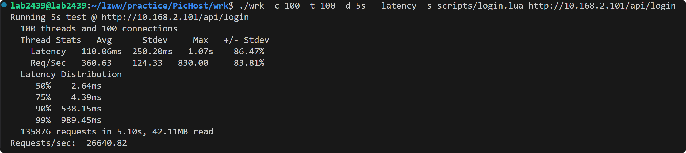

# 1. 测试准备
本地测试暂时使用wrk + lua进行测试。
wrk文件已经放在`PicHost/wrk`目录下，以添加了dkjson.lua(用于json序列化和反序列化)，可以直接使用，测试脚本写在`wrk/scripts`中。
**wrk基本参数：**
| 短选项 | 长选项        | 缩写 | 说明                                   |
|-------|-------------|----|----------------------------------------|
| -c    | --connections | N  | 跟服务器建立并保持的TCP连接数量             |
| -d    | --duration    | T  | 压测时间                                 |
| -t    | --threads     | N  | 使用多少个线程进行压测                       |
| -s    | --script      | S  | 指定Lua脚本路径                            |
| -H    | --header      | H  | 为每一个HTTP请求添加HTTP头                   |
| --latency       |     |    | 在压测结束后，打印延迟统计信息                 |
| --timeout      |    |  T   | 超时时间        |
| -v | --version    |     | 打印正在使用的wrk的详细版本信息                     |

+ **N**代表**数字**参数，支持国际单位 (1k, 1M, 1G)
+ **T**代表**时间**参数，支持时间单位 (2s, 2m, 2h)
**注：为适配wrk版本，lua脚本需下载5.3.0版本**

# 2. 测试样例
**本地测试**
```bashe
lab2439@lab2439:~/lzww/practice/PicHost/wrk$ ./wrk -c 20 -t 2 -d 20s --latency htt
p://10.168.2.101
Running 20s test @ http://10.168.2.101
  2 threads and 20 connections
  Thread Stats   Avg      Stdev     Max   +/- Stdev
                (平均值)   (标准差) (最大值) (正负一个标准差所占比例)
    Latency   297.60us    2.91ms  62.60ms   99.09%
    (延迟)
    Req/Sec   142.10k    13.49k  151.84k    96.77%
    (处理中的请求数)
  Latency Distribution (延迟分布)
     50%   55.00us
     75%   66.00us
     90%   78.00us
     99%  259.00us
  5683022 requests in 20.10s, 17.73GB read (20.10s内功出力完成了5683022个请求，读取了17.73GB数据)
Requests/sec: 282736.06  (平均每秒完成282736.06个请求)
Transfer/sec:      0.88GB (平均每秒读取0.88GB)
```

+ Latency 延迟时间
+ Req/Sec 每秒处理的请求数
+ 平均值(Avg)，
+ 标准偏差(Stdev)，
+ 最大值(Max)
+ 正负一个标准差占比(+/-) Stdev
**注：本机性能较高，i9-13900K的32核处理器(每核双线程)，64GB内存，NGINX8worker进程，带宽为1000MB/s**

## 2.1 注册测试
```bash
lab2439@lab2439:~/lzww/practice/PicHost/wrk$ ./wrk -c 100 -t 100 -d 5s --latency -s scripts/reg.lua http://10.168.2.101/api/reg
Running 5s test @ http://10.168.2.101/api/reg
  100 threads and 100 connections
  Thread Stats   Avg      Stdev     Max   +/- Stdev
    Latency     8.75ms    2.34ms  27.10ms   82.71%
    Req/Sec   113.47     14.04   191.00     72.26%
  Latency Distribution
     50%    8.39ms
     75%    9.62ms
     90%   11.04ms
     99%   20.41ms
  57997 requests in 5.10s, 15.60MB read
Requests/sec:  11370.21
Transfer/sec:      3.06MB
```

reg.lua大致的原理：
+ 通过随机字符串给`nickName`和`userName`赋值。
+ 然后发起post请求


## 2.2 登录测试
使用wrk/scripts/login.lua，服务端单线程模式处理
使用wrk/scripts/loginm.lua，服务端多线程模式处理
```bash
lab2439@lab2439:~/lzww/practice/PicHost/wrk$ ./wrk -c 100 -t 100 -d 5s --latency -s scripts/login.lua http://10.168.2.101/api/login
Running 5s test @ http://10.168.2.101/api/login
  100 threads and 100 connections
  Thread Stats   Avg      Stdev     Max   +/- Stdev
    Latency   110.06ms  250.20ms   1.07s    86.47%
    Req/Sec   360.63    124.33   830.00     83.81%
  Latency Distribution
     50%    2.64ms
     75%    4.39ms
     90%  538.15ms
     99%  989.45ms
  135876 requests in 5.10s, 42.11MB read
Requests/sec:  26640.82
Transfer/sec:      8.26MB
```


```bash
lab2439@lab2439:~/lzww/practice/PicHost/wrk$ ./wrk -c 100 -t 100 -d 5s --latency -s scripts/loginm.lua http://10.168.2.101/api/login
Running 5s test @ http://10.168.2.101/api/login
  100 threads and 100 connections
  Thread Stats   Avg      Stdev     Max   +/- Stdev
    Latency   112.87ms  251.85ms   1.06s    86.09%
    Req/Sec   388.41     97.82   484.00     91.24%
  Latency Distribution
     50%    2.58ms
     75%    3.27ms
     90%  551.49ms
     99%  981.70ms
  140054 requests in 5.10s, 43.40MB read
Requests/sec:  27462.41
Transfer/sec:      8.51MB
```

不难看出，多线程的登录测试相比单线程的登录测试在QPS和接收带宽方面均有提升。

## 3.3 文件测试
目前设置最多拉取10个文件信息，这里需要token，浏览器登录图床的时候通过F12观察调试窗口获取。

```bash
lab2439@lab2439:~/lzww/practice/PicHost/wrk$ ./wrk -c 100 -t 100 -d 5s --latency -s scripts/myfiles.lua http://127.0.0.1/api/myfiles&cmd=normal
[1]+  Done                    ./wrk -c 100 -t 100 -d 5s --latency -s scripts/myfiles.lua http://127.0.0.1/api/myfiles
[1] 3422515
lab2439@lab2439:~/lzww/practice/PicHost/wrk$ Running 5s test @ http://127.0.0.1/api/myfiles
  100 threads and 100 connections
  Thread Stats   Avg      Stdev     Max   +/- Stdev
    Latency   106.08ms  228.25ms   1.11s    88.69%
    Req/Sec    81.12     36.23   232.00     74.34%
  Latency Distribution
     50%    5.70ms
     75%   69.60ms
     90%  418.96ms
     99%  997.26ms
  30358 requests in 5.10s, 8.16MB read
Requests/sec:   5951.76
Transfer/sec:      1.60MB
```


